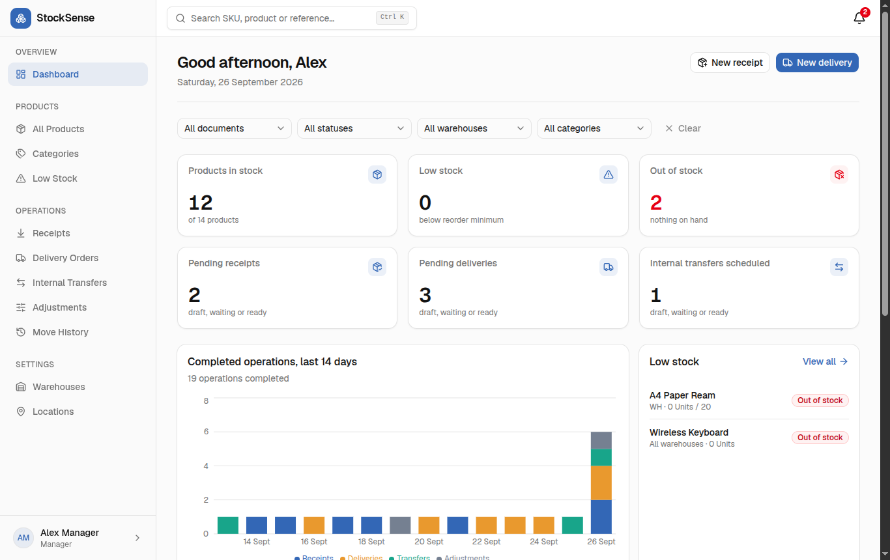
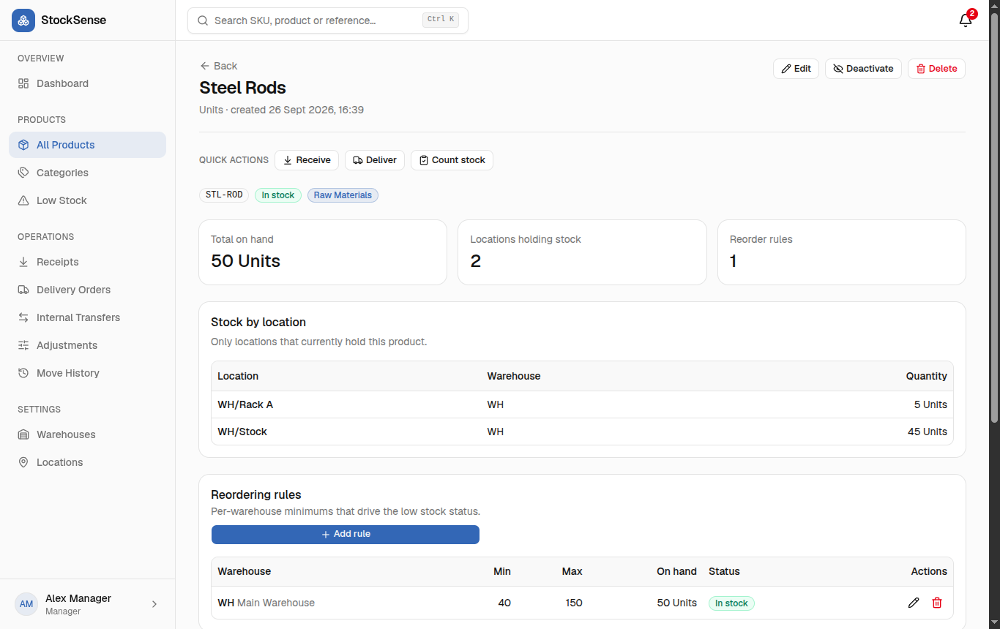
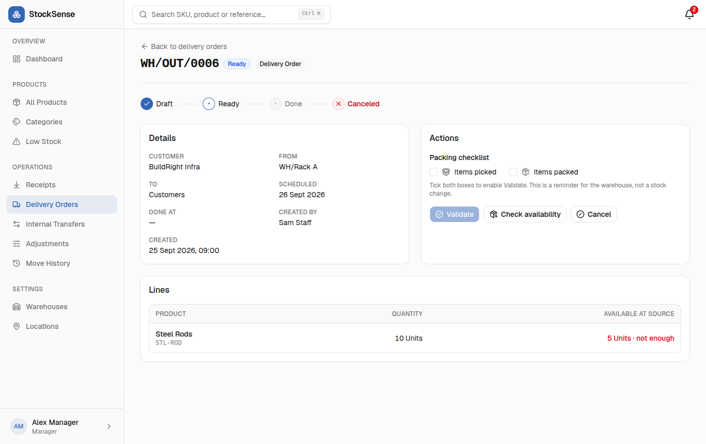
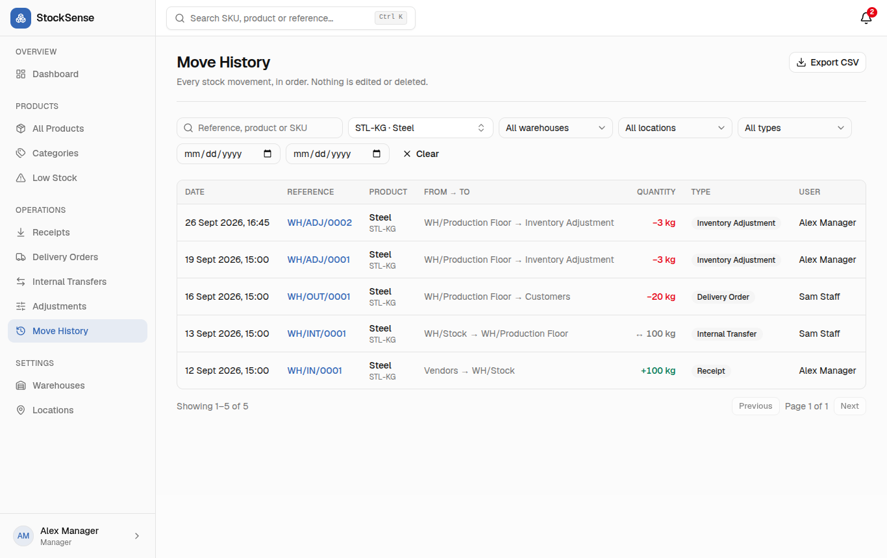
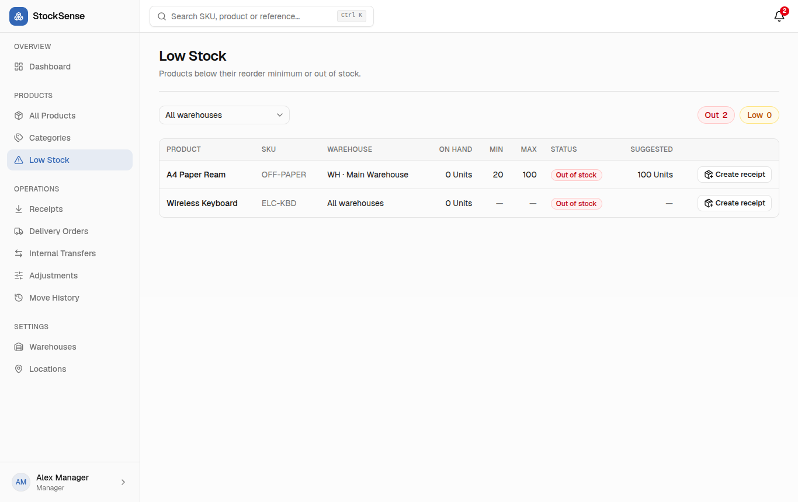
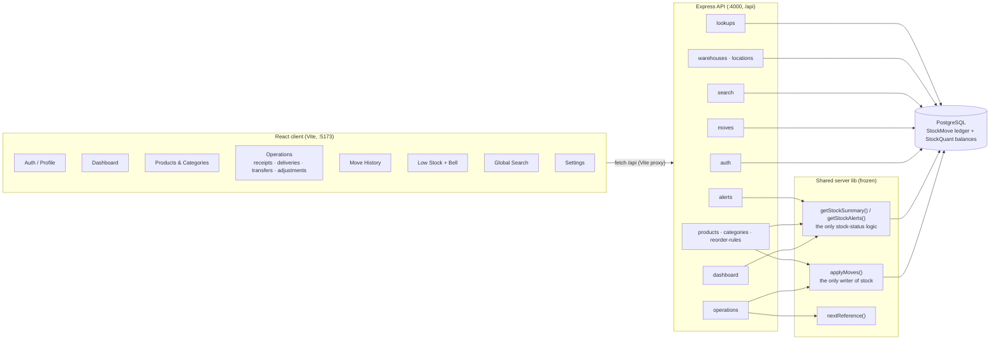
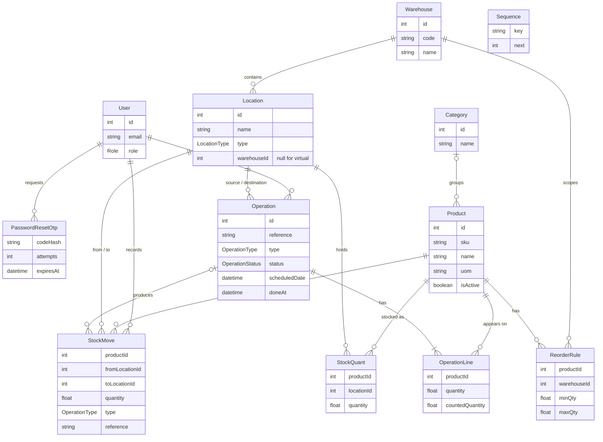

# StockSense

**Inventory that can't lie: every unit of stock is a row in a ledger, and one function is allowed to write it.**

StockSense is a multi-warehouse inventory management system built in 8 hours for the Odoo × GCET Hackathon 2026. Warehouse teams receive goods from vendors, move them between racks and warehouses, ship them to customers and correct counts. Every one of those actions is a *movement between locations*, written atomically to an append-only ledger. The dashboard, product list, low-stock alerts and move history all read from that same source, so they always agree. It runs fully offline on a local PostgreSQL.

---

## Screenshots

| Dashboard | Product detail |
|---|---|
|  |  |
| **Delivery order (pick / pack / validate)** | **Move history (the stock ledger)** |
|  |  |
| **Low-stock alerts** | |
|  | |

---

## Features mapped to the problem statement

| Requirement from the brief | How StockSense implements it | Where in the app |
|---|---|---|
| **Authentication with OTP reset** | Email + password login (JWT, bcrypt), signup with role (Manager / Staff). Forgot-password sends a 6-digit OTP (hashed, 10-minute expiry, 5 attempts), then lets you set a new password. Profile page to edit name/email and change password. | `/login`, `/signup`, `/forgot-password`, `/profile` |
| **Dashboard KPIs and filters** | KPI cards: products in stock, low stock, out of stock, pending receipts, pending deliveries, scheduled internal transfers. Each card links to the matching pre-filtered list. Filters by document type, status, warehouse and category, kept in the URL. A "late operations" banner, a 14-day completed-operations chart, a low-stock preview and a recent-operations table. | `/dashboard` |
| **Products, categories, reorder rules** | Product catalogue with search by name/SKU and filters by category, warehouse, stock status and inactive. Create with optional initial stock (recorded as a real ledger move). Detail page shows stock per location, reorder rules (min/max per warehouse), recent movements and quick actions. Categories CRUD. Products with history can't be deleted, only deactivated. | `/products`, `/products/:id`, `/products/categories` |
| **Receipts** | Vendor → internal location. Draft → Ready → Done workflow with supplier, scheduled date, notes and multiple product lines. References like `WH/IN/0001`. | Operations → Receipts |
| **Deliveries (pick / pack / validate)** | Internal location → customer. Confirm checks availability (Ready or Waiting). "Check availability" re-tests Waiting orders. A Pick → Pack checklist must be ticked before Validate is enabled. Each line shows live on-hand at the source. | Operations → Delivery Orders |
| **Internal transfers** | Internal → internal location, within or across warehouses, with the same availability check and atomic validation. | Operations → Internal Transfers |
| **Adjustments** | Pick a location and products (or "Count all products here"). Each line shows the recorded quantity; you enter what you counted and see the difference. On validation the system records the book quantity at that moment and writes only the difference (gain or loss) against the virtual "Inventory Adjustment" location. | Operations → Adjustments |
| **Move history** | The full stock ledger, filterable by product, location, warehouse, operation type, text search and date range. Paginated, with CSV export. Each row shows direction (in/out), from → to and who did it. | Operations → Move History (`/moves`) |
| **Low-stock alerts** | A top-bar bell with a live count (refreshes every minute). The alerts page lists each product below its per-warehouse minimum or out of stock, with a suggested reorder quantity and a "Create receipt" button that opens a pre-filled receipt. | Bell icon, Products → Low Stock (`/alerts`) |
| **Multi-warehouse** | Warehouses and their locations (manager CRUD, staff view-only). Reorder rules and references are per warehouse, and every list, KPI and alert can be scoped to one warehouse. | Settings → Warehouses / Locations |
| **SKU search** | Global search (`Ctrl K` / `⌘K`) finds products by name or SKU and operations by reference or partner, and jumps straight to them. | Search box in the top bar |

---

## Tech stack

| Layer | Choice | Why |
|---|---|---|
| Runtime | **Node.js 24 + TypeScript** (run with `tsx`) | One language end-to-end, no build step on the server. |
| API | **Express 5** | Minimal and well known. Async errors reach the error handler without boilerplate. |
| Database | **PostgreSQL 16+** | Real transactions and row-level atomic updates, which the stock ledger depends on. |
| ORM | **Prisma 6** | Typed queries, migrations and seed in one tool; interactive transactions for validation. |
| Validation | **Zod 3** (server and client) | The same rules on both sides, with readable field-level messages. |
| UI | **React 19 + Vite** | Fast dev loop and a small, modern toolchain. |
| Styling | **Tailwind CSS v4 + shadcn/ui (Radix)** | Accessible components we own in the repo, consistent look without a design phase. |
| Data fetching | **TanStack Query 5** | Caching and one-call invalidation of every stock-dependent view after a mutation. |
| Forms | **React Hook Form + zodResolver** | Performant forms that reuse the Zod schemas. |
| Routing | **React Router 7** | URL-driven filters, so every filtered view is linkable. |
| Charts / icons / toasts | **Recharts, lucide-react, sonner** | Lightweight and good defaults. |

---

## Architecture



**Core design.**
- **Everything is a movement between locations.** A receipt moves stock from the virtual *Vendors* location into a real one, a delivery moves it out to the virtual *Customers* location, and an adjustment moves the difference to or from the virtual *Inventory Adjustment* location. There are no special cases, only `from → to`.
- **Two tables hold stock.** `StockMove` is an append-only ledger (quantity always positive, direction given by from/to). `StockQuant` holds the current balance per product per internal location. The seed asserts that every balance equals its net moves.
- **One writer.** `applyMoves()` is the only code allowed to touch either table: product initial stock and all four operation types go through it.
- **Atomic validation.** Validating runs in one database transaction. It first claims the operation with a conditional `READY → DONE` update, so a double-click or second tab gets "Only ready operations can be validated" instead of counting twice. It then decrements each source with a conditional `quantity >= requested` update. If any line is short, the whole transaction rolls back with a clear `409` ("Not enough STL-ROD at WH/Rack A: available 5, requested 10"), so stock can never go negative, even under concurrency.
- **One stock-status rule.** OK / LOW / OUT is computed only in `getStockSummary()` / `getStockAlerts()`. The product list, dashboard KPIs, bell and alerts page therefore always show the same numbers.

---

## Data model



- `LocationType`: `INTERNAL` (real, belongs to a warehouse) or the virtual `VENDOR`, `CUSTOMER`, `ADJUSTMENT`.
- `OperationStatus`: `DRAFT → READY | WAITING → DONE`, or `CANCELED`.
- `Sequence` generates per-warehouse references such as `WH/OUT/0007`.

---

## Getting started

**Prerequisites:** Node.js 24 LTS (22 also works), PostgreSQL 16+, npm, Git.

1. **Create the database** (any name; it must match `DATABASE_URL`):
   ```bash
   createdb stocksense            # or in psql: CREATE DATABASE stocksense;
   ```
2. **Configure the server:**
   ```bash
   cp server/.env.example server/.env
   ```
   Then edit `DATABASE_URL` (user, password, database) and set `JWT_SECRET` to a long random string. SMTP settings are optional.
3. **Install, migrate and seed:**
   ```bash
   npm run setup
   ```
4. **Run:**
   ```bash
   npm run dev
   ```
   - App: <http://localhost:5173>
   - API: <http://localhost:4000/api> (health check: `/api/health`)

**Demo logins**

| Email | Password | Role |
|---|---|---|
| `manager@stocksense.local` | `Manager@123` | Manager (full access) |
| `staff@stocksense.local` | `Staff@123` | Staff (operations; settings view-only) |

> **Password reset codes print in the server console when SMTP isn't configured.** Look for the `EMAIL (StockSense)` block in the `npm run dev` output.

**Windows notes**
- Use `copy server\.env.example server\.env` instead of `cp`.
- Make sure the PostgreSQL service is running (Services → `postgresql-x64-16` → Start) before `npm run setup`.

The seed creates two warehouses (`WH`, `WH2`), 15 products (one inactive), reorder rules, and operations in every status. That includes the brief's Steel story: 100 kg received, transferred to production, 20 kg delivered, 3 kg written off, leaving 77 kg.

---

## Scripts

Run from the repository root:

| Command | What it does |
|---|---|
| `npm run setup` | Installs root, server and client dependencies, then resets, migrates and seeds the database. **Wipes data.** |
| `npm run dev` | Starts the API (`:4000`) and the client (`:5173`) together. |
| `npm run check` | Server typecheck, client typecheck and client production build. Must pass before every commit. |
| `npm run db:reset` | Resets and reseeds the database only. |

Inside `server/`: `db:studio` (Prisma Studio), `db:migrate`, `db:seed`, `typecheck`. Inside `client/`: `build`, `preview`, `typecheck`.

---

## Project structure

```
.
├── docs/
│   └── screenshots/           # images used in this README
├── server/
│   ├── prisma/                # schema.prisma, migrations, seed.ts
│   └── src/
│       ├── app.ts, index.ts
│       ├── lib/               # applyMoves, stock status, http, validate, auth, mailer…
│       ├── middleware/        # requireAuth, requireRole, error handler
│       └── modules/
│           ├── auth/  products/  settings/            # Person 1
│           ├── operations/                            # Person 2
│           ├── dashboard/  moves/  alerts/  search/   # Person 3
│           └── lookups/                               # shared, read-only
└── client/
    └── src/
        ├── app/               # router, layouts, auth provider, sidebar
        ├── components/        # common/ (DataTable, badges, dialogs…) + ui/ (shadcn)
        ├── lib/               # api client, query client, lookups, types, format
        └── features/
            ├── auth/  profile/  settings/  products/   # Person 1
            ├── operations/                             # Person 2
            └── dashboard/  moves/  alerts/  search/    # Person 3
```

---

## Team and workflow

| Owner | Scope |
|---|---|
| **Person 1** (Jay) | Auth and OTP reset, profile, warehouses and locations, products, categories, reorder rules. Built the **client foundation**. |
| **Person 2** (Samarth) | Operations: receipts, deliveries, transfers, adjustments, and the workflow and validation. |
| **Person 3** (Anshul) | Dashboard, move history, low-stock alerts and bell, global search, README and demo. Built the **server foundation** (schema, seed, `applyMoves`, stock status). |

- **Frozen shared contract first.** Before feature work, the foundation was built and frozen: schema, seed, the shared server lib, the client shell, and a written shared contract (endpoints, error codes, routes, query keys and cross-feature URLs). After that, nobody edited shared files. Changes went through "contract change requests" applied only at checkpoints.
- **One branch per person** (`p1/*`, `p2/*`, `p3/*`), with **strict folder ownership**. Features never import each other; they link through agreed URLs such as `/operations/receipts/new?productId=…&quantity=…`. This kept merges into `main` at each checkpoint conflict-free.
- **AI coding agents** implemented each task from a written prompt under shared agent rules: stay in your folders, validate everything, stock changes only through `applyMoves`, `npm run check` must pass. **A human reviewed every diff** and ran the app before each commit and merge.

---

## Validation and error handling

- **Zod on both sides.** Every request body, query string and route param is parsed on the server. Forms mirror the same rules on the client with React Hook Form, so errors appear under the field before anything is sent.
- **One error envelope.** Every failure returns `{ "error": { "code", "message", "details"? } }` with a meaningful status: `400 VALIDATION_ERROR` (with per-field errors), `401`, `403 FORBIDDEN`, `404 NOT_FOUND`, `409 CONFLICT / IN_USE / INSUFFICIENT_STOCK / INVALID_STATE`. Unexpected errors become `500 INTERNAL`, logged on the server, never leaked.
- **Human-readable messages.** The client shows the server's `message` directly in toasts, so users see things like *"This product has stock history. Deactivate it instead."* or *"Not enough FUR-CHAIR at WH/Stock: available 2, requested 8"*, not error codes.
- **Every page** has loading skeletons, empty states and an error state with retry, and works at 375 px width.
